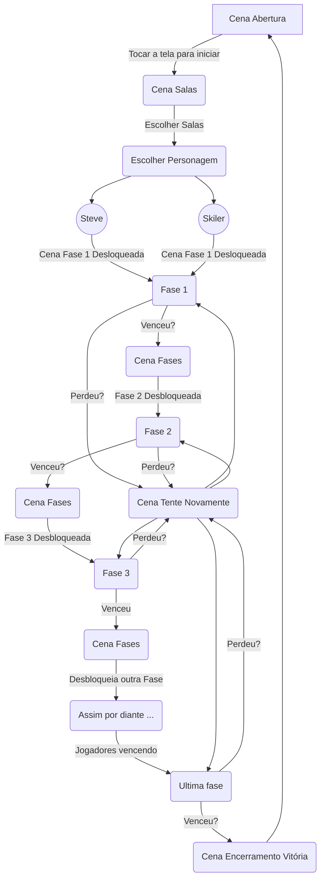

# FUTHOFF - A BUSCA PELO TROFÉU DOURADO.

## Premissa do Jogo:

"FutHoff: A Busca pelo Troféu Dourado" é um emocionante jogo de plataforma que acontece no mundo contemporâneo, na cidade de TownSide, um lugar onde o futebol é uma paixão unificadora. No entanto, problemas assolam a cidade e ameaçam a celebração do Torneio Troféu Dourado, um evento futebolístico de prestígio. Os personagens principais, inspirados pela determinação e espírito esportivo, devem enfrentar os irmãos Sturmhond, vilões cruéis e ambiciosos, para garantir que o troféu dourado permaneça em mãos justas. Os jogadores se envolverão na emocionante jornada dos personagens principais para proteger a cidade de TonwSide, celebrar o espírito esportivo e mostrar que o futebol pode ser um agente de mudança positiva no mundo contemporâneo. "FutHoff: A Busca pelo Troféu Dourado" é uma aventura épica que combina ação, plataforma e influências do futebol, proporcionando uma experiência emocionante e empolgante para os fãs do esporte e jogos de plataforma. O jogo ocorrerá de forma online, onde uma dupla jogará como Skiler ou Steve para enfrentar os irmãos Sturmhond.

## Referências do Jogo:

- Super Mario (jogo/filme);
- Sonic (jogo/filme);
- CupHead (saga);

## Receita do jogo:

- Versão gratuita com Anúncios;
- Versão premium sem Anúncios;
- Parcerias e patrocínios com empresas (principalmente de jogos);
- Compras dentro do jogo;

## Enredo do Jogo:

  Em um mundo contemporâneo onde o futebol é uma paixão unificadora, a cidade de TownSide é conhecida por sua vibrante cultura esportiva. A cada ano, o Torneio Troféu Dourado é realizado, onde as melhores equipes de futebol competem para levantar o cobiçado troféu dourado. No entanto, um mal está prestes a ameaçar a celebração anual do torneio.
  
  Os notórios irmãos Sturmhond, conhecidos por sua habilidade implacável no futebol e comportamento desleal, planejam tomar o controle do torneio e da cidade, espalhando a corrupção por onde passam. Eles estão determinados a garantir que o Troféu Dourado permaneça em suas mãos, não importando os meios que precisem usar.
  
  É aí que entram os personagens principais do jogo, dois grandes amigos jovens e talentosos jogadores de futebol da cidade, cada um com habilidades inspiradas no universo futebolístico. Eles são impulsionados pela paixão pelo futebol e pelo desejo de proteger a cidade que amam. Juntos, embarcam em uma missão para derrotar os irmãos Sturmhond e restaurar a justiça no Torneio Troféu Dourado.
  
  Ao longo do jogo de plataforma, os jogadores assumirão o controle dos personagens principais (selecionáveis), enfrentando desafios emocionantes em níveis inspirados por estádios, ruas movimentadas e locais emblemáticos de TownSide.
  
  Além disso, os irmãos Sturmhond enviarão seus próprios capangas, os "Craques Sombrios", para eliminar os personagens principais e assegurar a vitória no torneio. Esses craques sinistros são criaturas misteriosas e poderosas, cada um com habilidades sombrias relacionadas ao futebol.
  
  Os jogadores também podem coletar itens, como a "Ballpower”, por exemplo, e moedas ao longo do caminho para comprar melhorias às suas habilidades e powerups.
  
  Com trabalho em equipe, coragem e determinação, os personagens principais enfrentam desafios cada vez maiores, culminando em uma emocionante batalha final contra um dos irmãos Sturmhond no Estádio Dourado, o palco do torneio decisivo.
  
  O destino de TownSide está nas mãos dos jogadores, e cabe a eles derrotar os vilões, proteger o Troféu Dourado e restaurar a paixão e a justiça na cidade do futebol. 

## Sobre o Universo do Jogo:

- Cenários das fases: O jogador explorará cenarios vivos e vibrantes, os quais contam com desafios perigosos e inimigos determinados para impedir o jogador de conquistar o troféu.
- Personagens Jogáveis: Os jogadores podem escolher entre 2 personagens principais, cada um com habilidades relacionadas ao futebol. Eles são jovens apaixonados pelo esporte que se unem para salvar o torneio e a cidade. 
- Futebol e Plataforma: O jogo combina ação de plataforma empolgante com elementos de jogabilidade inspirados no futebol. Os jogadores enfrentarão desafios, como driblar obstáculos, acertar alvos com a bola, entre outras habilidades inspiradas nesse universo futebolístico.
- Torneio Troféu Dourado: O objetivo principal dos personagens principais é participar e vencer o Torneio Troféu Dourado, uma competição de futebol prestigiada.
- Irmãos Sturmhond - Os Vilões: Os irmãos Sturmhond são os antagonistas do jogo, buscando conquistar o Troféu Dourado para seus propósitos nefastos. Eles são mestres do futebol sujo e usam táticas desleais para vencer. Os jogadores devem enfrentar desafios difíceis para superar esses vilões habilidosos. 
- Os  Craques Sombrios - fases: Para além dos BOSS's principais, o jogo terá inimigos que dificultarão a passagem dos heróis durante as fases de plataformas com suas habilidades, são ele, os craques sombrios.
- Jogabilidade e Elementos: A jogabilidade é tipicamente de plataforma, onde os jogadores controlam Skiler (ou Steve) enquanto ela percorre vários níveis, superando obstáculos, coletando moedas e elementos especiais, derrotando inimigos e buscando ganhar o Torneio Troféu Dourado. 
- Seleção: Os jogadores podem selecionar o personagem que deseja jogar (menino ou menina), tornando-se verdadeiros campeões do futebol.
- Trilha Sonora Empolgante: A trilha sonora do jogo é cheia de músicas empolgantes e emocionantes que complementam a atmosfera do futebol e realçam a ação e a emoção do gameplay, além de fazer referência ao mundo do futebol.

## Personagens:

A história dos personagens principais, Skiler e Steve, em "TonwSide", é uma jornada de amizade, superação e trabalho em equipe, à medida que eles enfrentam os desafios impostos pelos irmãos Sturmhond e buscam proteger o torneio de futebol e conquistar o cobiçado troféu dourado.

### Skiler: 
Skiler é uma jovem de 16 anos apaixonada pelo futebol. Ela possui cabelos claros e olhos verdes que refletem sua determinação e coragem. Sua personalidade é destemida e dedicada. Ela é conhecida por sua ética de trabalho incansável e sua habilidade em motivar os outros ao seu redor. Ela é uma líder natural, mas seu psicológico é moldado por uma pressão interna para sempre se destacar e corresponder às expectativas dos outros. Ela lida com a necessidade de equilibrar a liderança e a autoconfiança com momentos de dúvida sobre suas próprias capacidades.

### Steve:
Steve é um jovem de 17 anos, amigo próximo de Skiler, e um jogador de futebol habilidoso. Ele tem cabelos castanhos e olhos castanhos. Sua personalidade é mais descontraída e enérgica, mas ele é igualmente apaixonado pelo esporte. Ele traz leveza e humor ao grupo, mas seu psicológico é marcado por uma autoimagem um tanto insegura, muitas vezes subestimando seu próprio valor. Sua jornada envolve ganhar confiança e reconhecer sua importância como membro da equipe.

### Craques Sombrios:
Os "Craques Sombrios" são um grupo de jogadores talentosos e habilidosos que se aliaram aos vilões principais, os irmãos Sturmhond, em busca de poder, reconhecimento e, em alguns casos, vingança. Eles foram recrutados pelos irmãos devido às suas habilidades excepcionais no futebol e à disposição de seguir os planos malignos em troca de fama, vantagens e a promessa de uma posição de destaque no mundo do esporte. 

### Irmãos Sturmhond:
A história dos Irmãos Sturmhond é uma saga de ambição, rivalidade e determinação, moldada por experiências de infância e uma busca incansável pelo poder. Lion, Erik e Morgan Sturmhond nasceram em uma família de renome, onde a competição era encorajada e o sucesso era medido por conquistas e vitórias. 

- Lion Sturmhond: Lion, o irmão mais velho, cresceu sob a sombra da glória de seu pai, um lendário jogador de futebol. No entanto, ele nunca conseguiu atender às expectativas de seu pai e isso alimentou um desejo feroz por provar seu valor. A ambição de Lion o levou a adotar uma abordagem implacável em relação ao sucesso. Ele acredita que o poder é a única maneira de ganhar respeito e está disposto a fazer qualquer coisa para alcançá-lo. Sua personalidade dominante e autoritária reflete uma necessidade constante de controle, um reflexo de sua luta por aceitação. Seu psicológico é moldado pela busca de reconhecimento e pela necessidade de superar a sombra de seu pai. 

- Erik Sturmhond: Erik, o irmão do meio, sempre foi o mais astuto e diplomático dos três. Ele percebeu desde cedo que a manipulação das mentes poderia ser mais poderosa do que a força física. Crescendo em um ambiente onde a imagem e a influência eram valorizadas, Erik aprendeu a usar sua sagacidade para obter vantagens. No entanto, ele também lida com conflitos internos, pois sua busca por poder muitas vezes entra em conflito com sua empatia e compaixão. Seu psicológico é moldado pela luta entre seus desejos de controle e sua consciência moral.

- Morgan Sturmhond: Morgan, a irmã mais nova, cresceu em um ambiente competitivo e procurou encontrar seu lugar único dentro da família. Ela sempre observou a rivalidade entre seus irmãos mais velhos e escolheu um caminho diferente. Sua beleza e charme a tornaram mestra na arte da ilusão. Ela anseia por se destacar e ser valorizada por suas habilidades únicas. Por trás de sua aparência encantadora, Morgan esconde inseguranças e uma busca por identidade. Seu psicológico é uma mistura complexa de autoafirmação e constante busca por aceitação. 

## Objetivos do Jogo:

- Conquistar o Troféu Dourado: O objetivo dos personagens principais é vencer o Torneio Troféu Dourado, uma competição de futebol de prestígio em TonwSide. Para isso, eles devem progredir através das fases, enfrentar desafios e chefes, como os irmãos Stumrhond.
- Derrotar os Irmãos Sturmhond: Os personagens principais devem enfrentar os maléficos irmãos Sturmhond, que estão determinados a vencer o torneio de forma desonesta e dominar a cidade. Os jogadores devem superar os obstáculos criados pelos vilões e confrontá-los em batalhas emocionantes para restaurar a justiça no futebol e proteger o Troféu Dourado.
- Coletar Moedas e Itens: Ao longo das fases, os personagens devem coletar moedas para adquirir melhorias e power-ups que os ajudarão em sua jornada, como a “Ballpower” e a "Cleat Shield".
- Enfrentar os “craques sombrios”: Ao longo do jogo, os personagens principais encontrarão como inimigos também os “craques sombrios”, capangas dos irmãos Sturmhond. Os jogadores devem derrotar esses inimigos usando suas habilidades inspiradas no futebol.
- Alcançar a Pontuação Máxima: O jogo incentiva os jogadores a buscar a pontuação máxima em cada fase, coletando moedas, derrotando inimigos e concluindo desafios bônus. A competição pela melhor pontuação pode levar a recompensas adicionais.

## Regras do Jogo (Plataforma):
- Os jogadores podem coletar itens espalhados pelos níveis, como moedas, power-ups e outros bônus. Esses itens podem conceder vidas extras ou fornecer outras vantagens temporárias.
- Os jogadores podem controlar os personagens principais usando as teclas direcionais para se mover para a esquerda ou direita, bem como para pular e descer uma escada. Além disso, os personagens têm uma variedade de movimentos especiais relacionados ao futebol, como chutar a bola e derrubar inimigos com o famoso "carrinho", apertando a tecla especial na tela.
- Os níveis são compostos por plataformas e obstáculos. Os jogadores devem pular entre as plataformas, evitar os obstáculos e usar suas habilidades.
- Os jogadores enfrentarão inimigos padrões ao longo das fases, além dos "Craques Sombrios" e outros vilões em encontros especiais (Irmãos Sturmhond). Os inimigos podem ser derrotados usando movimentos especiais relacionados ao futebol ou evitados com agilidade e estratégia;
- Normalmente, os craques sombrios poderão ser derrotados tanto por carrinho ou se o personagem pular em cima deles;
- Os jogadores normalmente começam com um número limitado de vidas. Cada vez que o personagem é derrotado por inimigos ou cai em um obstáculo, ele perde uma vida. Quando todas as vidas são perdidas, o jogador deve recomeçar o nível.
- Tomar cuidado com os ataques do inimigo para não ser eliminado; 
- O jogo é dividido em várias fases que ocorrem em locais diversos de TonwSide, incluindo estádios, ruas da cidade e até mesmo locais inusitados. Cada fase apresenta desafios únicos, como obstáculos de plataforma e inimigos.
- Os jogadores não podem alternar entre os personagens principais durante o jogo, cada um deve escolher o seu personagem, ou Skiler ou Steve. 
- O principal objetivo do jogo é derrotar os vilões, os irmãos Sturmhond, e seus aliados, os "Craques Sombrios", para proteger a cidade de TonwSide e ganhar o Troféu Dourado.

## Fluxograma Das Cenas:

 ## Desenvolvimento do Jogo: 

### Cena abertura:
- Os dois personagens jogando bola e inimigos atrás;
- Jogador clica na tela para avançar;

### Cena salas:
- Fundo com bolas e com botões interativos falando o número das salas;
- Jogador escolhe uma sala para jogar. Observação: tem que ser a mesma de seu amigo;
	
### Cena escolher personagem:
- Jogadores escolhem entre steve ou skiler, ambos não podem escolher o mesmo personagem;

### Cena "Prólogo --> Campeonato Troféu dourado":
- Primeiro "cai" um papel na tela, jogador clica na tela para avançar;
  
### Cena panfleto sobre torneio:
- Ao clicar na tela, vem o anúncio do torneiro troféu dourado;
- Mensagem no panfleto:
  
Anúncio Oficial: O Torneio Troféu Dourado Começou em TonwSide!

TonwSide, é hora de entrar em campo e mostrar suas habilidades no espetacular Torneio Troféu Dourado, um torneio de prestígio como nenhum outro!

O que é o Torneio Troféu Dourado?
É a competição de futebol mais emocionante e desafiadora que TonwSide já viu! Todos são bem-vindos para participar e se tornar uma lenda do futebol de plataforma.

Destaques do Torneio:
- Partidas de futebol de plataforma incrivelmente empolgantes.
- Forme equipes com seus amigos e desafie outros jogadores.
- Vença obstáculos, derrote os Irmãos Sturmhond e busque o Troféu Dourado.
- Ganhe prêmios incríveis e o reconhecimento da cidade.

Como Participar:
Reúna sua equipe, inscreva-se e prepare-se para enfrentar jogadores de todas as idades e níveis de habilidade. O Torneio Troféu Dourado é para todos!

TonwSide, é a sua chance de brilhar no Torneio de Prestígio!
Mostre ao mundo do que você é capaz e torne-se uma lenda do futebol de plataforma. Inscreva-se agora e prepare-se para uma competição inesquecível!

### Após cena do panfleto:

- Skyler: (com entusiasmo) Ei, Steve, você não vai acreditar no que acabei de ouvir! Parece que vai acontecer o Torneio Troféu Dourado em TonwSide!
  
- Steve: (interessado) O Troféu Dourado? Sério? Eu sempre sonhei em participar desse torneio lendário.
  
- Skyler: (animada) É exatamente o que estou pensando! E o melhor é que as inscrições estão abertas para equipes de dois jogadores. Nós dois formaríamos uma dupla imbatível!

- Steve: (empolgado) Isso é incrível! Imagine só, nós dois representando nossa cidade em um torneio tão prestigioso. Mal posso esperar para entrar em campo e mostrar do que somos capazes
  
- Skyler: (determinada) Então, o que acha, Steve? Vamos nos inscrever, treinar duro e fazer história no Troféu Dourado?
  
- Steve: (decidido) Absolutamente, Skyler! Estamos dentro. Vamos mostrar a todos que TonwSide tem os melhores jogadores de futebol e que estamos prontos para qualquer desafio!

### Vem a primeira fase;

### Os heróis vencem a primeira fase;

### Fim da Primeira fase:

- Lion Sturmhond: (com um sorriso maquiavélico) Parece que nossos "amigos" da primeira fase estão causando mais problemas do que eu esperava, não é?
  
- Erik Sturmhond: (com um olhar calculista) É verdade, Lion. Eles são mais habilidosos do que imaginávamos. Devemos manter um olho neles.

- Morgan Sturmhond: (com um toque de sarcasmo) Ah, o casal de heróis. Eles têm coragem, isso é certo. Mas a coragem não vai impedi-los de enfrentar nosso próximo desafio.
  
- Lion Sturmhond: (com um tom desafiador) Eles podem ter passado pela primeira fase, mas isso é apenas o começo. Vamos mostrar a eles do que os verdadeiros jogadores são feitos e garantir que nunca cheguem perto do Troféu Dourado.

- Erik Sturmhond: (planejando) Precisamos ser mais astutos em nossas próximas ações. Vamos traçar um plano para lidar com eles e garantir que não interfiram em nossos objetivos.
  
- Morgan Sturmhond: (com um sorriso sinistro) Afinal, o Troféu Dourado é nosso destino, não deles. Vamos jogar sujo se for necessário.
  
- Lion Sturmhond: (determinado) Isso mesmo, Morgan. Não permitiremos que nada nem ninguém atrapalhe nossa busca pelo Troféu Dourado. Eles são apenas um obstáculo temporário em nosso caminho.

- Erik Sturmhond: (pensativo) Vamos reunir os "Craques Sombrios" e criar estratégias ainda mais engenhosas. Desta vez, não deixaremos margem para erro.

### Inicio segunda fase (primeira fase Boss):

- Skyler: (entusiasmada) Steve, conseguimos! Passamos pela primeira fase do Torneio Troféu Dourado!

- Steve: (sorrindo) Isso foi incrível, Skiler! Trabalhamos bem juntos lá fora. Quem teria pensado que superaríamos todos aqueles desafios?

- Skyler: (determinada) É verdade, Steve. Mostramos do que somos capazes. Agora, estamos um passo mais perto do Troféu Dourado, e TonwSide está nos apoiando.

- Steve: (grato) Estou orgulhoso de fazer parte deste time, Skyler. Juntos, somos imparáveis. Mas, lembre-se, ainda temos um longo caminho pela frente.

- Skyler: (olhando para o futuro) Com certeza, Steve. As próximas fases serão mais difíceis, mas estamos preparados. Vamos continuar treinando duro e nos apoiando. Nada vai nos deter!

### Fim da segunda fase;

#### Heróis:

- Skyler: (ofegante, após a partida) Uau, Steve, conseguimos! Passamos pela segunda fase!

- Steve: (animado) Foi uma partida incrível, Skyler! Mas parece que apenas um dos irmãos Sturmhond estava lá para nos enfrentar.

- Skyler: (preocupada) Isso me preocupa. Será que eles estão planejando algo nos bastidores? Seria bom se soubéssemos mais sobre eles.

- Steve: (determinado) Não importa o que eles estejam planejando, não vamos desistir. Nossa jornada rumo ao Troféu Dourado continua. Eles podem ser poderosos, mas nós também somos.

#### ENQUANTO ISSO ...

#### Vilões:

- Lion Sturmhond: (com raiva) Droga! Como eles conseguiram nos vencer? Isso não deveria ter acontecido!

- Erik Sturmhond: (frustrado) Parece que subestimamos esses garotos. Eles são mais habilidosos do que pensávamos.

- Morgan Sturmhond: (calma, mas inquieta) Não importa. Uma derrota temporária não pode nos deter. Temos mais truques na manga.

- Lion Sturmhond: (com determinação) Precisamos ser mais cuidadosos e estratégicos da próxima vez. Não podemos falhar em nossa busca pelo Troféu Dourado.

- Erik Sturmhond: (planejando) Vamos reunir nossos aliados e elaborar um plano mais sólido. Não cometeremos os mesmos erros novamente.

- Morgan Sturmhond: (com um sorriso sinistro) E quando encontrarmos os garotos da próxima vez, eles não terão ideia do que os atingiu.

### Começa terceira fase;

### Heróis vencem;

### Fim terceira fase:

- Lion Sturmhond: (com frustração) Eu não posso acreditar nisso! Eles venceram a terceira fase do Torneio Troféu Dourado!

- Erik Sturmhond: (irritado) Isso não deveria ter acontecido. Nós estávamos tão perto de eliminá-los!

- Morgan Sturmhond: (com um olhar determinado) Não podemos subestimá-los, irmãos. Eles são mais habilidosos do que pensávamos. Precisamos reforçar nossas estratégias.

- Lion Sturmhond: (com determinação renovada) Isso é certo. Não importa o que aconteça, não podemos deixar que eles cheguem perto do Troféu Dourado.

- Erik Sturmhond: (planejando) Vamos reunir nossos aliados e elaborar um plano mais sólido para a próxima fase. Não podemos falhar novamente.

- Morgan Sturmhond: (com um sorriso sinistro) E quando encontrarmos os heróis da próxima vez, eles enfrentarão um desafio que nunca viram antes.

### Início quarta fase (segunda fase Boss);

### Fim quarta fase:

#### Vilões:

- Lion Sturmhond: (com frustração) Isso não pode estar acontecendo! Perdemos a quarta fase do Torneio Troféu Dourado!

- Erik Sturmhond: (irritado) Como eles conseguiram nos derrotar novamente? Esses heróis são mais problemáticos do que imaginávamos.

- Morgan Sturmhond: (com um olhar sombrio) Não podemos subestimá-los, irmãos. Eles são mais habilidosos do que parecem. Precisamos repensar nossas estratégias.

- Lion Sturmhond: (com determinação renovada) É isso mesmo. Não podemos deixar que eles se aproximem do Troféu Dourado. Devemos elimina-los desse torneio de uma vez por todas.

### Início quinta fase;

### Heróis vencem quinta fase:

- Skyler: (comemorando) Steve, conseguimos! Passamos pela quinta fase do Torneio Troféu Dourado!

- Steve: (sorrindo) Isso foi incrível, Skyler! Estamos mais perto do Troféu Dourado do que nunca.

- Skyler: (determinada) Foi uma vitória e tanto, Steve. Mas não podemos subestimar o que os irmãos Sturmhond podem fazer. Eles são engenhosos e perigosos.

- Steve: (refletindo) Você está certa, Skyler. Temos que continuar treinando duro e nos preparando para o que vem a seguir. Esta competição está longe de terminar.

### Inicio sexta fase (terceira fase boss e última fase):

- Skyler: (com determinação) Steve, estamos prestes a enfrentar a última fase do Torneio Troféu Dourado. Este é o momento que treinamos tanto para alcançar.

- Steve: (confiante) Você está certa, Skyler. Nós superamos desafios incríveis até aqui, e agora só falta uma etapa para chegarmos ao Troféu Dourado.

- Skyler: (olhando para o futuro) Lembra-se de como começamos? Com um sonho e uma determinação inabalável. Vamos lembrar disso enquanto enfrentamos os últimos obstáculos.

- Steve: (refletindo) Estamos prestes a fazer história, Skyler. Independentemente do que aconteça, estamos orgulhosos do que conquistamos até agora.

- Skyler: (sorrindo) E não vamos esquecer que temos TonwSide torcendo por nós. Vamos dar o nosso melhor e mostrar ao mundo do que somos capazes!

### Fim última fase:

#### Vilões:

- Lion Sturmhond: (com uma expressão de raiva) Isso não pode estar acontecendo! Perdemos na última fase do Torneio Troféu Dourado!

- Erik Sturmhond: (frustrado) Não posso acreditar que fomos derrotados pelos heróis. Eles são mais formidáveis do que jamais imaginamos.

- Morgan Sturmhond: (com um olhar sombrio) Não subestimemos mais esses heróis. Eles provaram ser implacáveis. Nossos planos foram arruinados.

- Lion Sturmhond: (com determinação renovada) Precisamos encontrar uma maneira de dar a volta por cima. Não podemos permitir que eles cheguem ao Troféu Dourado.

- Erik Sturmhond: (planejando) Vamos reunir nossos aliados e criar um plano mais sólido para o futuro. Eles podem ter vencido esta batalha, mas a guerra ainda não acabou.

- Morgan Sturmhond: (com um sorriso sinistro) Quando encontrarmos os heróis novamente, eles enfrentarão um adversário muito mais formidável. Eles ainda não viram o pior de nós.

#### Heróis:

- Skyler: (com um sorriso radiante) Steve, nós conseguimos! Vencemos o Torneio Troféu Dourado!

- Steve: (eufórico) Incrível, Skyler! Foi uma jornada longa e desafiadora, mas chegamos lá. Somos campeões!

- Skyler: (agradecida) Não teríamos conseguido sem nossa determinação e trabalho em equipe. E, claro, com o apoio de TonwSide.

- Steve: (orgulhoso) TonwSide sempre esteve ao nosso lado, torcendo por nós. Agora, somos heróis da cidade.

- Skyler: (refletindo) Foi uma jornada incrível, Steve. Vencemos os vilões, superamos todos os obstáculos e conquistamos o Troféu Dourado.

- Steve: (sorrindo) E este é apenas o começo, Skyler. Quem sabe o que o futuro reserva para nós? Estamos prontos para enfrentar qualquer desafio que vier.

### Cena Encerramento:
- Herois com o troféu;

### Volta para tela inicial;

## Sobre as fases: 

### Fase 1:

### Fase 2 (Fase Boss):

### Fase 3:

### Fase 4 (Fase Boss):

### Fase 5:

### Fase 6 (Fase Boss):

